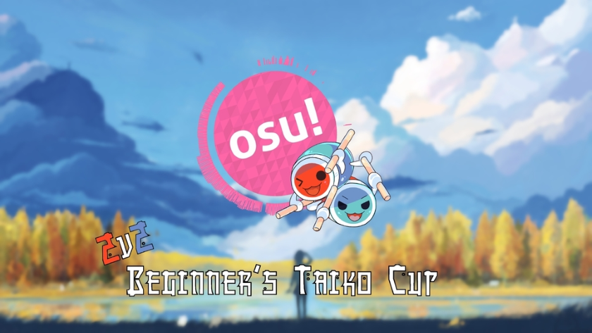

# Beginners Taiko Tournament Season 2
*****

The **Beginners Taiko Tournament** is a tournament that lets players getting into Taiko into the limelight, hosted by Taiko enthusiasts. This is the second installment of the Beginners Taiko Tournament, and has become a much larger project since last season. This season's gimmick is based around the number 2! Season 2, 2v2, 2 players per team resulting in 2 winners.

>**Directory**

>[1. Tournament Schedule](/wiki/Tournaments/Beginners_Taiko_Tournament/season2.md#tournament-schedule)

>[2. Prize](/wiki/Tournaments/Beginners_Taiko_Tournament/season2.md#prize)

>[3. Staff](/wiki/Tournaments/Beginners_Taiko_Tournament/season2.md#organizationstaff)

>[4. Reference Links](/wiki/Tournaments/Beginners_Taiko_Tournament/season2.md#links-for-reference)

>[5. Participants](/wiki/Tournaments/Beginners_Taiko_Tournament/season2.md#participants)

>[6. Ruleset](/wiki/Tournaments/Beginners_Taiko_Tournament/season2.md#ruleset)

## Tournament Schedule

| Event | Time Occurrence (MM/DD/YY) |
| ---: | :--- |
| Registration | 05/04/17 - 06/01/17 |
| Group Stage | 06/02/17 - 06/04/17 |
| Post-Group Stage | 06/09/17 - 06/11/17 |
| Quarter-Finals | 06/16/17 - 06/18/17 |
| Semi-Finals | 06/23/17 - 06/25/17 |
| Finals | 06/29/17 - 07/02/17 |

(note not finalized as registration is still on-going)

## Prize

For this season, a badge will be rewarded to the winning pair. In the future, more may be given for winners. The badge that is awarded looks like this:
(insert badge image here when received)

## Organization/Staff

The Beginners Taiko Tournament's staff size has increased considerably from last season, including multiple organizers. The tournament in the end is run by those enthusiastic to introducing players to the world of Taiko.

| Role | Member |
| -------: | :------- |
| Organizers | [ FlamingRok](https://osu.ppy.sh/u/2015353), [ Swovine](https://osu.ppy.sh/u/6666316), [ jh1h1h](https://osu.ppy.sh/u/9140302) |
| Mappool Selectors | [ FlamingRok](https://osu.ppy.sh/u/2015353), [ Swovine](https://osu.ppy.sh/u/6666316), [ jh1h1h](https://osu.ppy.sh/u/9140302), [ Unmei Muma](https://osu.ppy.sh/u/481582) |
| Referees (NA/SA) | [ Swovine](https://osu.ppy.sh/u/6666316), [ DiggyDogg](https://osu.ppy.sh/u/5014664) |
| Referees (EU) | [ -Leafeon](https://osu.ppy.sh/u/6956922) |
| Referees (Asia) | [ jh1h1h](https://osu.ppy.sh/u/9140302), [ Minisora](https://osu.ppy.sh/u/9627666), [ tkdLolly](https://osu.ppy.sh/u/9035344), [ nullfathi](https://osu.ppy.sh/u/1696519) |
| Commentators | [ Edgar_Figaro](https://osu.ppy.sh/u/6508754), [ Minisora](https://osu.ppy.sh/u/9627666), [ DiggyDogg](https://osu.ppy.sh/u/5014664), [ InsaneToe](https://osu.ppy.sh/u/6389252), [ jh1h1h](https://osu.ppy.sh/u/9140302) |

## Links for Reference

- [Tournament Thread](https://osu.ppy.sh/forum/t/590076)
- Livestream (link will be active in a few days!)

## Participants

| Team Name (if applicable) | Members |
| -----: | :----- |
| PicoPalQueLee | [ [Burno-]](https://osu.ppy.sh/u/4397758), [ Sebaeza](https://osu.ppy.sh/u/2898699) |
| | [ Pony Cultist](https://osu.ppy.sh/u/8800023), [ InsaneMadness](https://osu.ppy.sh/u/8579186) |
| Sexy Snowmen | [ she rack](https://osu.ppy.sh/u/4580584), [ Carnate](https://osu.ppy.sh/u/7635738) |
| SLAMJAYM29 | [ Remyton](https://osu.ppy.sh/u/6771356), [ c418vgytre](https://osu.ppy.sh/u/4692795)
| FreePeePee | [ Kizmah](https://osu.ppy.sh/u/8325847), [ CaptainEChan](https://osu.ppy.sh/u/9536977)
| | [ tartrium](https://osu.ppy.sh/u/6794701), [ mountepic](https://osu.ppy.sh/u/6682402) |
| | [ Charisma](https://osu.ppy.sh/u/7992040), [ PKFP](https://osu.ppy.sh/u/8729962)
| Quantum Nature | [ chrisny](https://osu.ppy.sh/u/3119955), [ Heam](https://osu.ppy.sh/u/4705120) |
| The Savage Butterflies | [ That One Girl](https://osu.ppy.sh/u/9292128), [ Rukairi](https://osu.ppy.sh/u/6642597) |
| Midnight Demons | [ Gato2499](https://osu.ppy.sh/u/7857559), [ InsaneToe](https://osu.ppy.sh/u/6389252) |
| | [ TGOY](https://osu.ppy.sh/u/10158510), [ Douhboi](https://osu.ppy.sh/u/7039811) |
| | [ Starger](https://osu.ppy.sh/u/3398715), [ c41125](https://osu.ppy.sh/u/6380925) |
| WeAreCouple<3) | [ Braixen](https://osu.ppy.sh/u/4871378), [ VanillaSandvich](https://osu.ppy.sh/u/2782093) |
| rerorerorero | [ nullfathi](https://osu.ppy.sh/u/1696519), [ madaoka-chan](https://osu.ppy.sh/u/6510109)
| Hrr tfu jeba? | [ Hatiso](https://osu.ppy.sh/u/9011751), [ Moreon](https://osu.ppy.sh/u/5286078) |
| | [ CrosisBH](https://osu.ppy.sh/u/CrosisBH), [ Gamelan4](https://osu.ppy.sh/u/9856910) |
| | [ davidminh0111](https://osu.ppy.sh/u/9623142), [ Shimemem](https://osu.ppy.sh/u/7083420) |
| | [ maylypeji](https://osu.ppy.sh/u/7083420), [ PhantomHunt3r](https://osu.ppy.sh/u/7052926) |

## Ruleset

>**Mini-Directory**

>[1. Tournament Rules](/wiki/Tournaments/Beginners_Taiko_Tournament/season2.md#tournament-rules)

>[2. Stage Instructions](wiki/Tournaments/Beginners_Taiko_Tournament/season2.md#stage-instructions)

>[3. Match Instructions](/wiki/Tournaments/Beginners_Taiko_Tournament/season2.md#match-instructions)

>[4. Mappool Instructions](/wiki/Tournaments/Beginners_Taiko_Tournament/season2.md#mappool-instructions)

>[5. Scheduling Instructions](/wiki/Tournaments/Beginners_Taiko_Tournament/season2.md#scheduling-instructions)

### Tournament Rules

1. The tournament is a two player team based tournament, and is double elimination style.

2. The mappool will be announced on Monday of the week. The categories are as follows:
    -NoMod, HardRock, Hidden, DoubleTime, FreeMod, TieBreaker

3. The scoring will be using ScoreV1, as ScoreV2 is not finalized yet. When ScoreV2 is finalized, further testing will be used to determine whether or not it works best for the Beginners Taiko Tournament.

4. All the match scheduling will be done for the contestants.

5. If the TieBreaker is tied, the TieBreaker will be replayed but with FreeMod rules.

6. If a player disconnects from the game, the opponent takes the round. The exception is if the player disconnects within the first five seconds of the map. If this is the case, the match will be restarted.

7. Maps cannot be chosen twice for a match.

8. You have 20 minutes to show up to your scheduled match. If the opponent doesn't show up, the team who shows up can either agree to play a 1v2 or ask for a default win and advance.

### Stage Instructions

1. There are five stages in the tournament: Group Stage, Post-Group Stage, Quarter-finals, Semi-finals, and Finals.

2. Matches are randomly selected within PP averages and timezones, with closer timezones having higher priority.

3. During all matches except the Finals, it's Bo7 to win. During the finals, it is Bo9.

4. If it occurs that the Winner of the Losers' Bracket wins the first time in the Grand Finals, the tournament is subject to a bracket reset. They play a final set because both players only have one set loss in the tournament.

### Match Instructions

1. A private match will be created for both teams a few minutes before the scheduled start time of the match. Make certain you're online in time for the match to begin.

2. Each time is allowed one warm-up under 3 minutes long.

3. The map selection is always done by the losing team. The first pick however is decided by the !roll. The winner gets to decide whether they ban or pick first. If the losing team catches ties the game, the opposing team chooses next. This is to ensure the other team has a chance to catch back up.

4. If both teams are tied 3-3 (4-4 for the finals), the tiebreaker is used.

5. All results will be announced by the referee and the bracket will be updated accordingly.

### Mappool Instructions

1. The mappool will change each round, progressively becoming harder.

2. The mappool consists of four NoMod maps, two HardRock maps, two Hidden maps, two DoubleTime maps, two FreeMod maps, and a single TieBreaker.

3. If a FreeMod is chosen, Flashlight is prohibited.

4. The TieBreaker will be played without any mods unless the TieBreaker ends in a tie. If this happens, the TieBreaker is replayed but on Freemod.

5. The mappool is released on the Monday of the week.

### Scheduling Instructions

1. Every match happens during the weekend after the mappool is released to ensure time for practice on the mappool. Matches will begin on Friday, and will go on until Sunday.

2. Matches will try to not overlap to ensure every match can be streamed.

3. If the match comes up empty without any reschedule planned within the weekend, both players will be eliminated.